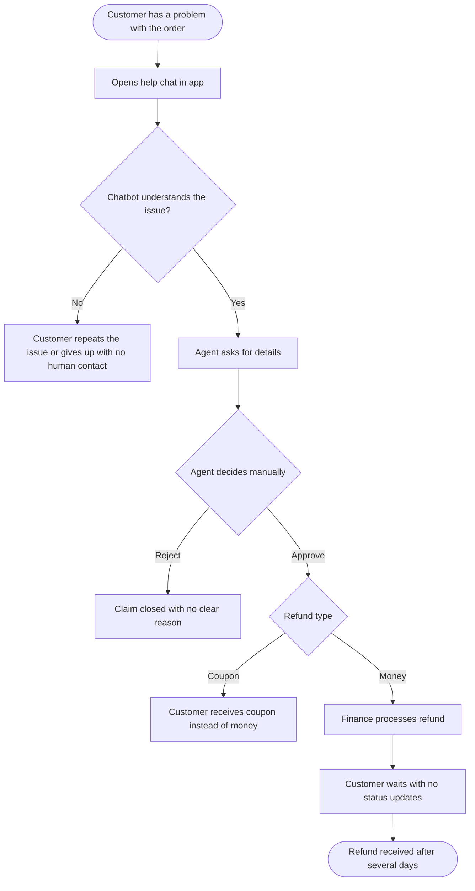

# AS-IS Process: Refund Handling Today (Simplified Model)

> This model is inferred from public review themes (see `research/review-themes.md`). It is not QuickBite's actual process.

## Pain points

| ID | Pain point | Review theme |
|---|---|---|
| P1 | Chatbot cannot resolve the issue and there is no easy route to a person | 3 |
| P2 | Agent decisions are manual and inconsistent | 1, 2 |
| P3 | Rejections come with no clear reason | 2 |
| P4 | Coupons offered instead of money | 2 |
| P5 | No status updates while waiting for the refund | 2, 4 |
| P6 | Payment errors and cancellations with no automatic correction | 4 |
