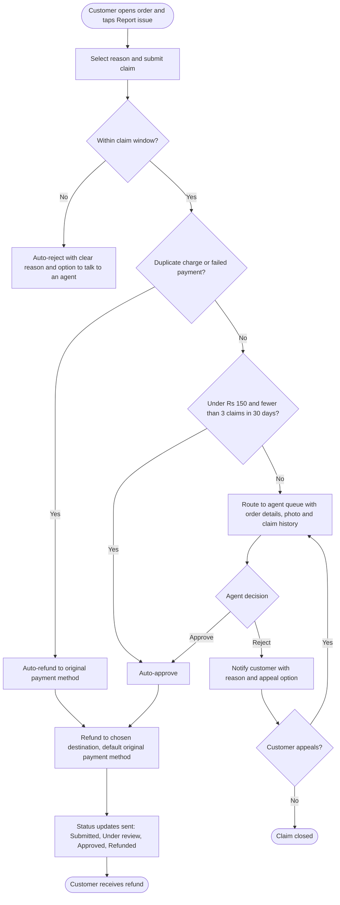

# TO-BE Process: Proposed Refund Handling

## What changes and why

| AS-IS pain point | TO-BE change |
|---|---|
| P1 No route to a person | Talk to an agent option after the chatbot fails twice or a claim is rejected |
| P2 Inconsistent decisions | Rule-based auto-approval; agents see claim history |
| P3 No rejection reason | Every rejection shows a reason and an appeal option |
| P4 Coupons instead of money | Refund goes to the original payment method by default |
| P5 No status updates | Status shown and updated at every stage |
| P6 Payment errors | Duplicate charges and failed-payment orders refunded automatically |
